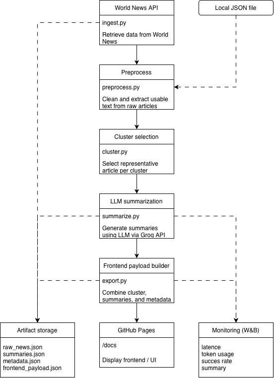

# AI News Summary Pipeline

This project implements an end-to-end LLM-powered news summarization pipeline with a focus on MLOps practices, reproducibility, and deployment.

The system ingests real-world news data, clusters related articles, generates concise summaries using LLMs, and publishes results through a lightweight frontend.

## Project Overview

The pipeline performs the following steps:

1. **Data ingestion**
   Fetches clustered news data from an external API.
2. **Preprocessing and clustering**
   Selects representative articles per cluster and filters low-quality content.
3. **LLM-based summarization**
   Generates concise summaries for each news cluster.
4. **Artifact storage**
   Stores results and metadata for each run.
5. **Frontend serving**
   Publishes the latest results via GitHub Pages.

## Pipeline Architecture

```markdown
## Pipeline Architecture



*Figure: End-to-end pipeline from news ingestion to frontend deployment, including preprocessing, clustering, LLM-based summarization, and artifact generation.*

The diagram illustrates how raw news data flows through the system, from external ingestion to structured summaries served on the frontend. Each stage is modular and reproducible, enabling both production runs and evaluation workflows.
```

## Repository Structure

```text
app/
  core/
    ├── ingest.py          # API + JSON ingestion
    ├── preprocess.py      # Cleaning & text extraction
    └── cluster.py         # Cluster processing logic

  production/
    ├── pipeline.py        # Production pipeline orchestration
    ├── summarize.py       # LLM summarization
    └── export.py          # Frontend payload builder

  evaluation/
    ├── pipeline.py        # Evaluation pipeline
    ├── generate_candidates.py  # Generates summaries from multiple models
    ├── judge.py           # LLM-based evaluation (pairwise comparison)
    ├── compare.py         # Aggregates results
    └── run_evaluation.py  # Entrypoint for running evaluation

  utils/
      ├── utils.py         # Shared utilities
      ├── wandb_eval_logger.py
      └── wandb_logger.py  # wandb logging

data/eval                  # Fixed dataset for evaluation

artifacts/
  ├── production/          # Production runs
  └── evaluation/          # Evaluation runs

docs/
  └── latest.json          # Latest frontend data

main.py                    # Entry point
Dockerfile
docker-compose.yml
```

## Setup and Installation

1. Clone the repository:

```bash
git clone https://github.com/dhjerresen/news_summary.git
cd news_summary
```

2. Create environment variables in a `.env` file:

```env
WORLDNEWS_API_KEY=your_api_key
GROQ_API_KEY=your_groq_key
```

3. Install dependencies:

```bash
pip install -r requirements.txt
```

## Running the Pipeline

Run locally:

```bash
python main.py
```

This will:

- Fetch the latest news clusters
- Generate summaries
- Build the frontend payload
- Save results to `artifacts/production/`
- Update `docs/latest.json`

## Running with Docker

```bash
docker-compose up --build
```

This runs the pipeline in a fully reproducible containerized environment.

## Artifacts and Reproducibility

Each run generates a unique `run_id` and stores the following artifacts:

- `raw_news.json` – snapshot of the input data
- `summaries.json` – generated summaries and per-cluster metadata
- `frontend_payload.json` – final output used by the frontend
- `metadata.json` – run configuration, preprocessing statistics, and aggregated metrics

Artifacts are stored in:

artifacts/production/<run_id>/

The latest output used by the frontend is:

docs/latest.json

## Monitoring and Metadata

Each run logs:

- Number of clusters processed
- Successful vs. failed summaries
- Model and prompt configuration
- Aggregated latency and token usage
- Timestamp and source configuration

Detailed per-cluster information is stored in `summaries.json` and optionally visualized via Weights & Biases.

## Experiment Tracking (Weights & Biases)

The pipeline logs runs to Weights & Biases (W&B), including:

- Run configuration (model, prompt version, parameters)
- Aggregated metrics (latency, token usage, success rate)
- Per-cluster summary table
- Stored artifacts (JSON outputs)

This enables monitoring, comparison across runs, and debugging.

## Artifact Storage

Artifacts are stored locally in the `artifacts/` directory and included in the repository to ensure accessibility and transparency of pipeline outputs.

Each run produces a structured set of artifacts, including raw inputs, generated summaries, and metadata. This setup allows results to be easily inspected, shared, and used by the frontend without requiring external storage dependencies.

## Frontend

Live site:

<https://dhjerresen.github.io/news_summary/>

The frontend displays:

- Latest summaries
- Source metadata
- Cluster context
- Pipeline metrics

## Automation (GitHub Actions)

The pipeline is automatically executed:

- Daily via cron
- Manually via workflow dispatch

Results are committed back to the repository and published to GitHub Pages.

## Evaluation Pipeline

The project includes an evaluation module using LLM-as-a-judge:

- Generates summaries with multiple models
- Performs pairwise comparison
- Aggregates results into a leaderboard

Run manually:

```bash
python -m app.evaluation.run_evaluation
```

## MLOps Considerations

This project demonstrates:

- End-to-end pipeline orchestration
- Reproducible execution with Docker and CI
- Artifact versioning per run
- Separation of core and production logic
- Automated deployment via GitHub Actions
- Evaluation with LLM-as-a-judge

## License

This project was developed as part of an MLOps-focused assignment.
